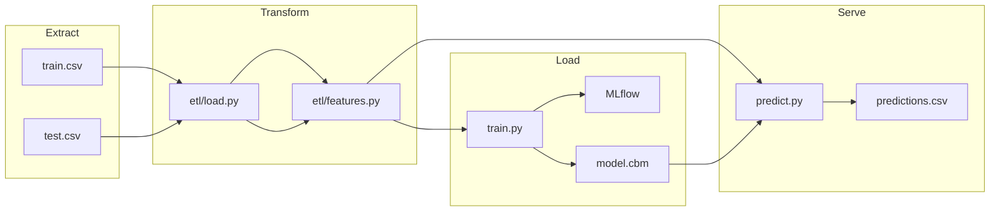

# Фамилия Имя — Прогноз отказов оборудования (keis7)

Итоговый проект по дисциплине **«Автоматизация машинного обучения»** (Нетология).  
Автоматизированный ML-пайплайн для бинарной классификации отказов промышленного оборудования на датасете [Kaggle Playground Series S3E17](https://www.kaggle.com/competitions/playground-series-s3e17).

> **Ссылка на GitHub:** https://github.com/Deferon/bhemml-25-amo-2  
> Доступ преподавателю: добавьте collaborator `@ElenaSmyslovskikh`.

---

## 1. Бизнес-задача

Производственное оборудование генерирует телеметрию (температура, обороты, момент, износ инструмента). Необходимо **заранее оценивать вероятность отказа** (`Machine failure`), чтобы:

- сократить внеплановые простои;
- планировать обслуживание по риску, а не по календарю;
- выдавать рекомендации по КПД и износу инструмента.

Исходный аналитический кейс: репозиторий [keis7-main](keis7-main) (ноутбуки `case7.ipynb`, CatBoost в `special_versions/`).

---

## 2. Схема пайплайна



---

## 3. ETL (Extract, Transform, Load)

| Этап | Модуль | Описание |
|------|--------|----------|
| **Extract** | `src/etl/load.py` | Загрузка CSV, проверка схемы и пропусков |
| **Transform** | `src/etl/features.py` | Инженерные признаки из `case7.ipynb`, удаление противоречивых строк (`Machine failure=0` при активных флагах отказа) |
| **Load** | `src/train.py` | Обучение CatBoost, сохранение модели и метрик в `artifacts/` |

**Ключевые преобразования:**

- `delta_temperature [K]` = Process − Air temperature  
- `Power [kW]` = Torque × RPM / 9550  
- `efficiency [%]` — КПД системы  
- `total_failures_cum` — накопленная сумма флагов отказов по (Type, Product ID)

---

## 4. Архитектура ML-модели

- **Алгоритм:** CatBoostClassifier  
- **Признаки:** температуры, RPM, момент, износ, Type, TWF/HDF/PWF/OSF, инженерные поля  
- **Балансировка:** `auto_class_weights=Balanced`  
- **Валидация:** stratified hold-out 80/20  
- **Early stopping** по AUC на validation set  

> **Примечание:** флаги TWF/HDF/PWF/OSF сильно коррелируют с целевой переменной (как в EDA keis7). Для учебного кейса они включены; для production рекомендуется отдельная модель без них.

Конфигурация: [`src/config.py`](src/config.py).

---

## 5. Метрики модели

После обучения метрики сохраняются в [`artifacts/metrics.json`](artifacts/metrics.json). Пример smoke-прогона (5000 строк):

| Метрика | Значение |
|---------|----------|
| ROC-AUC | ~0.93 |
| Recall | ~0.79 |
| Precision | ~0.39 |
| F1 | ~0.52 |
| Время обучения | ~13 с |

Ориентир из исходного проекта: [`keis7-main/model_metadata.json`](keis7-main/model_metadata.json).

**Графики:** `artifacts/plots/` — confusion matrix, ROC, feature importance.

---

## 6. AutoML и автоматизация пайплайна

По ТЗ допускается автоматизация элементов архитектуры (не обязателен внешний AutoML-сервис).

Реализовано:

1. **Единый конфиг** гиперпараметров CatBoost (`CATBOOST_PARAMS` в `config.py`).  
2. **Скрипт обучения** `python -m src.train` с артефактами и MLflow.  
3. **Скрипт инференса** `python -m src.predict` → `predictions.csv`, `maintenance_recommendations.csv`.  
4. **CI smoke-тест** — автоматический прогон обучения на подвыборке в GitHub Actions.  
5. **Docker** — воспроизводимый запуск train/predict в контейнере.

---

## 7. Тестирование (pytest)

```bash
pip install -r requirements.txt
pytest -q                  # без медленных тестов
pytest -q -m slow          # полный smoke на 5000 строк
```

| Тест | Проверка |
|------|----------|
| `tests/test_load.py` | Схема train.csv |
| `tests/test_features.py` | Формулы Power, efficiency |
| `tests/test_train.py` | Smoke-обучение и метрики |

---

## 8. Docker

### Dockerfile (используемый образ и команды)

```dockerfile
FROM python:3.11-slim
WORKDIR /app
RUN apt-get update && apt-get install -y --no-install-recommends libgomp1 \
    && rm -rf /var/lib/apt/lists/*
COPY requirements.txt .
RUN pip install --no-cache-dir -r requirements.txt
COPY src/ ./src/
COPY conftest.py pytest.ini ./
COPY keis7-main/train.csv keis7-main/test.csv ./keis7-main/
ENV PYTHONPATH=/app
RUN mkdir -p /app/artifacts
ENTRYPOINT ["python", "-m"]
CMD ["src.train", "--smoke"]
```

### Зачем контейнеризация

- фиксированные версии библиотек (воспроизводимость);
- изоляция от локального окружения;
- единый способ запуска на CI/CD и сервере.

### Команды

```bash
docker build -t machine-failure-mlops:latest .

docker run --rm -v "%cd%/artifacts:/app/artifacts" machine-failure-mlops:latest src.train
docker run --rm -v "%cd%/artifacts:/app/artifacts" machine-failure-mlops:latest src.predict

docker compose up train
docker compose up mlflow   # UI на http://localhost:5000
```

---

## 9. CI/CD

Workflow: [`.github/workflows/ci.yml`](.github/workflows/ci.yml)

1. `checkout`  
2. `setup-python` 3.11  
3. `pip install -r requirements.txt`  
4. `pytest -q`  
5. `docker build` + smoke `src.train --smoke` в контейнере  

### Git-команды (использованные при разработке)

```bash
git init
git status
git add .
git commit -m "Initial MLOps pipeline for machine failure prediction"
git branch -M main
git remote add origin https://github.com/<user>/bhemml-25-amo-2.git
git push -u origin main
```

Для обновлений: `git add`, `git commit`, `git push`, при необходимости `git pull`, `git branch`, `git checkout -b feature/...`.

---

## 10. Мониторинг

### Качество модели (MLflow)

- URI: `sqlite:///artifacts/mlflow.db`  
- Логируются: параметры CatBoost, ROC-AUC, Precision, Recall, F1, время обучения  
- Артефакты: модель, графики, `data_quality.json`  

Просмотр (после `docker compose up mlflow` или локально):

```bash
mlflow ui --backend-store-uri sqlite:///artifacts/mlflow.db
```

### Качество данных и дрейф

- `artifacts/data_quality.json` — статистики train  
- `artifacts/inference_monitoring.json` — PSI и сдвиг средних на test  

### Инфраструктура

Модуль `src/monitoring.py` фиксирует CPU/RAM (`psutil`) до и после обучения.

---

## 11. Быстрый старт (локально)

```bash
python -m venv .venv
.venv\Scripts\activate
pip install -r requirements.txt

python -m src.train          # полное обучение
python -m src.train --smoke  # быстрый прогон
python -m src.predict
```

Структура проекта:

```
bhemml-25-amo-2/
├── src/           # пайплайн
├── tests/         # pytest
├── keis7-main/    # исходные данные и ноутбуки
├── artifacts/     # модель, метрики, предсказания
├── docs/          # презентация
├── Dockerfile
├── docker-compose.yml
└── .github/workflows/ci.yml
```

---

## 12. Презентация

Структура слайдов (5–7): [`docs/presentation.md`](docs/presentation.md).

---

## 13. Участники и формат

- Формат: **индивидуальный** проект  
- ФИО в названии: замените «Фамилия Имя» в заголовке README  

---

## Лицензия и данные

Данные: Kaggle Playground Series S3E17. Исходные ноутбуки keis7 — учебный репозиторий команды кейса 7.
