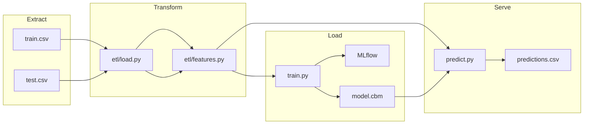
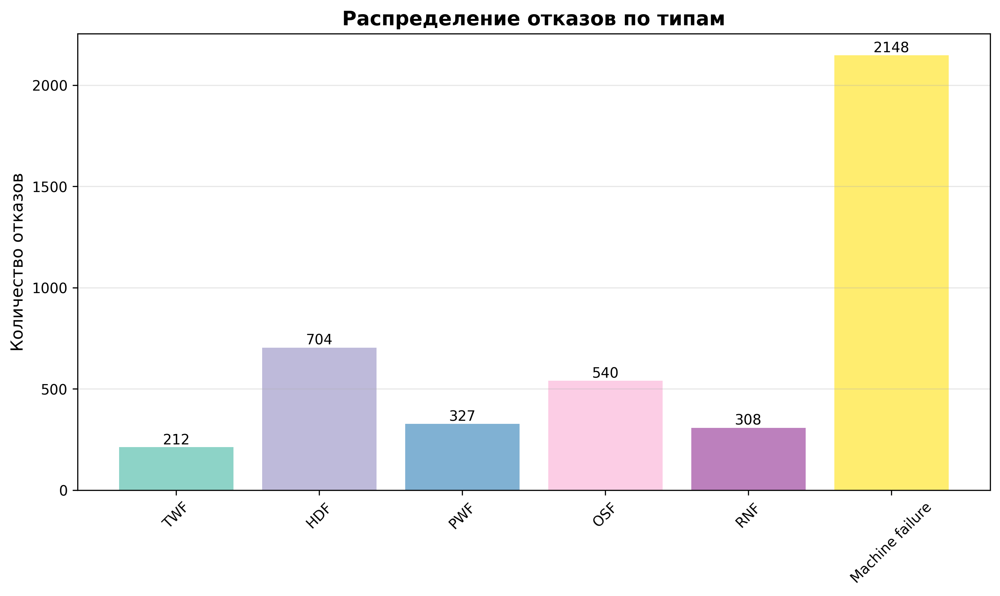
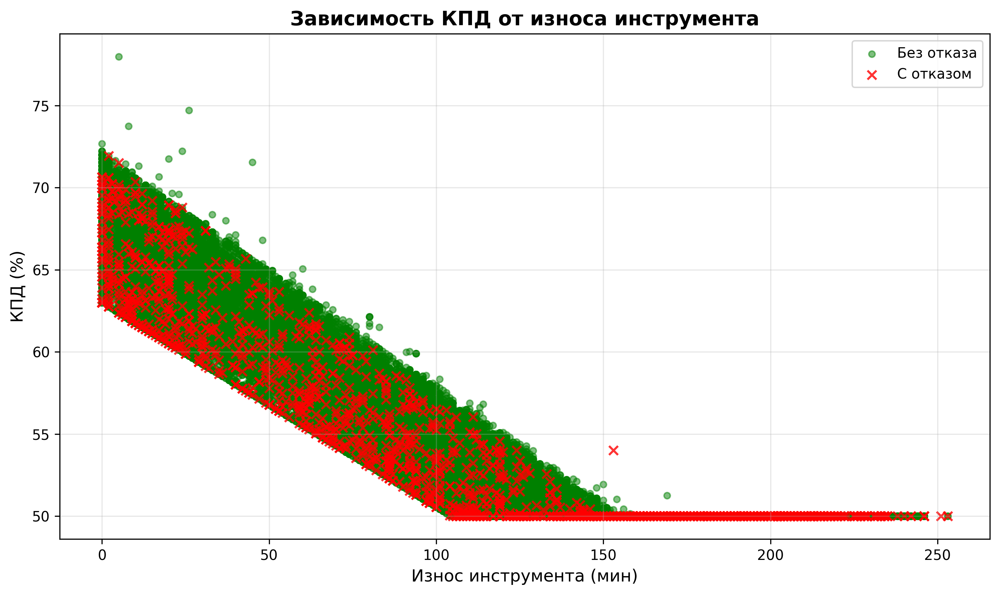
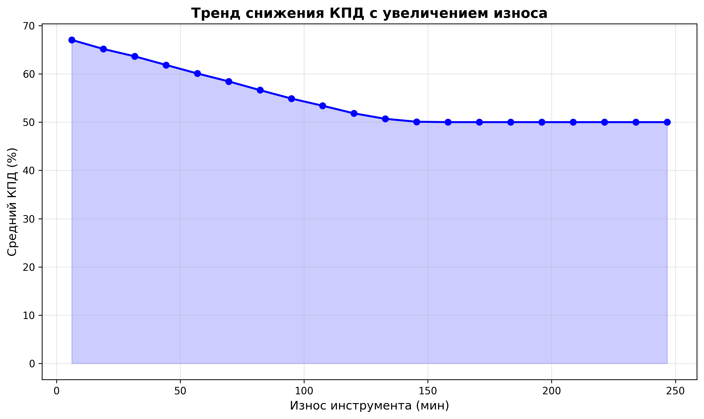
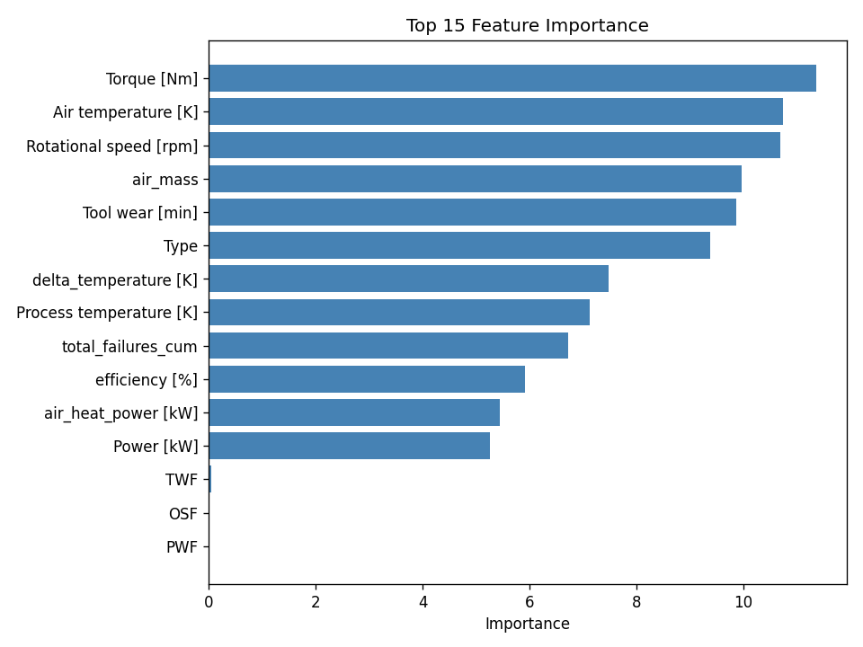
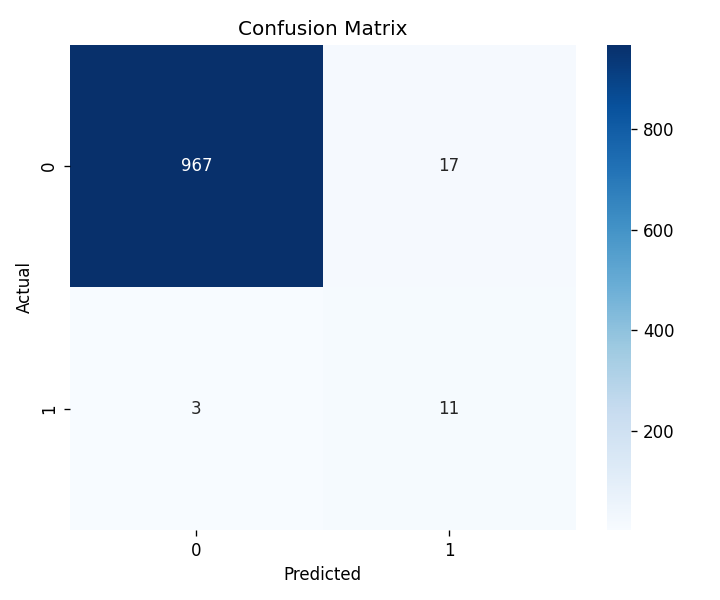
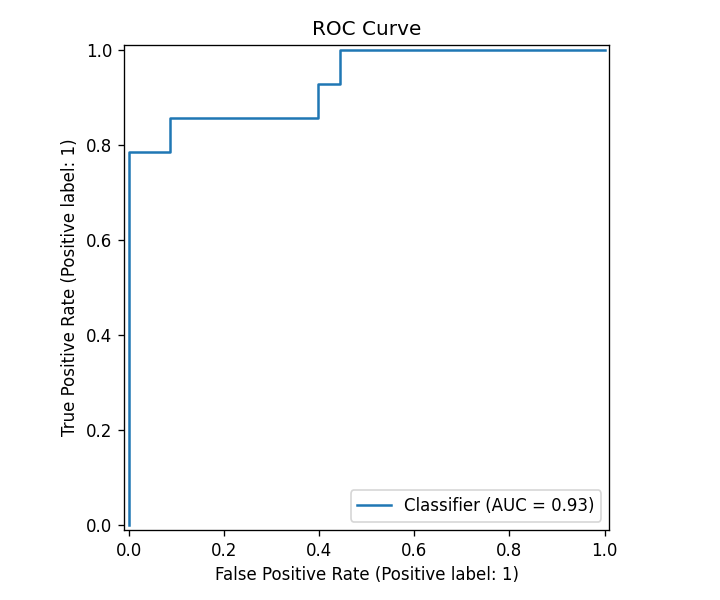

# Фамилия Имя — Прогноз отказов оборудования (keis7)

Итоговый проект по дисциплине **«Автоматизация машинного обучения»** (Нетология).  
Автоматизированный ML-пайплайн для бинарной классификации отказов промышленного оборудования на датасете [Kaggle Playground Series S3E17](https://www.kaggle.com/competitions/playground-series-s3e17).

> **Ссылка на GitHub:** https://github.com/Deferon/bhemml-25-amo-2  
> Доступ преподавателю: добавьте collaborator `@ElenaSmyslovskikh`.

---

## 1. Бизнес-задача

Производственное оборудование генерирует телеметрию (температура, обороты, момент, износ инструмента). Необходимо **заранее оценивать вероятность отказа** (`Machine failure`), чтобы:

- сократить внеплановые простои;
- планировать обслуживание по риску, а не по календарю;
- выдавать рекомендации по КПД и износу инструмента.

Исходный аналитический кейс: [reference-material/keis7-research](reference-material/keis7-research) (ноутбуки `case7.ipynb`, CatBoost в `special_versions/`). Данные для пайплайна: `keis7-main/train.csv`, `keis7-main/test.csv`.

---

## 2. Схема пайплайна



---

## 3. ETL (Extract, Transform, Load)

| Этап | Модуль | Описание |
|------|--------|----------|
| **Extract** | `src/etl/load.py` | Загрузка CSV, проверка схемы и пропусков |
| **Transform** | `src/etl/features.py` | Инженерные признаки из `reference-material/keis7-research/case7.ipynb`, удаление противоречивых строк (`Machine failure=0` при активных флагах отказа) |
| **Load** | `src/train.py` | Обучение CatBoost, сохранение модели и метрик в `artifacts/` |

**Ключевые преобразования:**

- `delta_temperature [K]` = Process − Air temperature  
- `Power [kW]` = Torque × RPM / 9550  
- `efficiency [%]` — КПД системы  
- `total_failures_cum` — накопленная сумма флагов отказов по (Type, Product ID)

---

## 4. Архитектура ML-модели

- **Алгоритм:** CatBoostClassifier  
- **Признаки:** температуры, RPM, момент, износ, Type, TWF/HDF/PWF/OSF, инженерные поля  
- **Балансировка:** `auto_class_weights=Balanced`  
- **Валидация:** stratified hold-out 80/20  
- **Early stopping** по AUC на validation set  

> **Примечание:** флаги TWF/HDF/PWF/OSF сильно коррелируют с целевой переменной (как в EDA keis7). Для учебного кейса они включены; для production рекомендуется отдельная модель без них.

Конфигурация: [`src/config.py`](src/config.py).

---

## 5. Аналитика и результаты

### 5.1. Исходные данные

| Параметр | Значение |
|----------|----------|
| Источник | [Kaggle Playground Series S3E17](https://www.kaggle.com/competitions/playground-series-s3e17) |
| Train | ~136 429 записей (`keis7-main/train.csv`) |
| Test | ~90 954 записей (`keis7-main/test.csv`) |
| Целевая переменная | `Machine failure` (бинарная) |
| Доля отказов (train) | **~1,6–1,8%** (сильный дисбаланс классов) |
| Типы оборудования | **L** (low), **M** (medium), **H** (high) |

**Сырые признаки:** `Air temperature [K]`, `Process temperature [K]`, `Rotational speed [rpm]`, `Torque [Nm]`, `Tool wear [min]`, `Type`, флаги отказов **TWF, HDF, PWF, OSF, RNF**.

**Инженерные признаки (пайплайн):** `delta_temperature [K]`, `Power [kW]`, `air_mass`, `air_heat_power [kW]`, `efficiency [%]`, `total_failures_cum`.

---

### 5.2. EDA — разведочный анализ (keis7)

Исходное исследование: [`reference-material/keis7-research/`](reference-material/keis7-research/) (ноутбуки `case7.ipynb`, `keis7_explorer.ipynb`, отчёт [`analysis_results_20251206_154833/`](reference-material/keis7-research/analysis_results_20251206_154833/)).

**Общая статистика по train (06.12.2025, 136 429 записей):**

| Показатель | Значение |
|------------|----------|
| Средний КПД системы | **55,82%** (диапазон 50–78%) |
| Средний износ инструмента | **104,4 мин** (0–253 мин) |
| Перепад температуры | **10,08 K** (3,2–15,0 K) |
| Всего отказов | **4 239** |
| Доля измерений с отказом | **1,8%** |

**Ключевые выводы EDA:**

- Сильная **отрицательная корреляция** между КПД и износом инструмента → регулярная замена инструмента поддерживает эффективность.
- Отказы чаще при износе **~1,2× выше среднего**.
- Наиболее частый тип события — `Machine failure`.
- Флаги TWF/HDF/PWF/OSF **сильно связаны** с целевой переменной (учтено в модели; для production рекомендуется отдельная модель без них).

**Рекомендации из EDA:**

- Оповещение при КПД **< 80%**.
- Плановая замена инструмента каждые **~200 мин** работы.
- Мониторинг температурного режима (оптимальный перепад **15–25 K**).
- Усиленная диагностика при износе **> 150 мин**.
- Переход к **предиктивному обслуживанию** на исторических данных.

**Графики EDA:**

| Распределение отказов | КПД vs износ | Тренд КПД |
|-----------------------|--------------|-----------|
|  |  |  |

---

### 5.3. Качество данных после ETL

Отчёт: [`artifacts/data_quality.json`](artifacts/data_quality.json) (последний smoke-прогон, 4 987 строк после очистки).

| Показатель | Значение |
|------------|----------|
| Пропуски | **0** по всем колонкам |
| Доля `Machine failure` | **1,38%** |
| Type L / M / H | 3 493 / 1 137 / 357 |

**Средние значения числовых признаков (train, после feature engineering):**

| Признак | Mean | Std |
|---------|------|-----|
| Air temperature [K] | 299,85 | 1,85 |
| Process temperature [K] | 309,92 | 1,38 |
| Rotational speed [rpm] | 1 520,8 | 140,9 |
| Torque [Nm] | 40,41 | 8,49 |
| Tool wear [min] | 105,08 | 64,26 |

**Test-выборка (инференс):** 90 954 строк, пропусков нет; распределение Type — L: 63 438, M: 21 535, H: 5 981 ([`artifacts/inference_monitoring.json`](artifacts/inference_monitoring.json)).

---

### 5.4. Метрики модели CatBoost

Алгоритм: **CatBoostClassifier**, stratified hold-out **80/20**, `auto_class_weights=Balanced`, early stopping по **AUC**.

**Текущие метрики пайплайна** ([`artifacts/metrics.json`](artifacts/metrics.json), smoke 5 000 строк):

| Метрика | Значение |
|---------|----------|
| **ROC-AUC** | **0,934** |
| **Recall** | **0,786** |
| **Precision** | **0,393** |
| **F1** | **0,524** |
| **Accuracy** | **0,980** |
| Время обучения | **~5,3 с** |

> Низкий Precision типичен для сильно несбалансированного класса: модель агрессивнее ловит отказы (высокий Recall).

**Базовое исследование keis7** (кросс-валидация, [`model_metadata.json`](reference-material/keis7-research/model_metadata.json)):

| Метрика | Mean | Std |
|---------|------|-----|
| ROC-AUC | 0,927 | 0,007 |
| Recall | 0,804 | 0,024 |
| Precision | 0,364 | 0,012 |
| F1 | 0,501 | 0,013 |

---

### 5.5. Важность признаков (Top-5)

| Признак | Importance |
|---------|------------|
| Torque [Nm] | 11,37 |
| Air temperature [K] | 10,75 |
| Rotational speed [rpm] | 10,68 |
| air_mass | 9,97 |
| Tool wear [min] | 9,87 |



---

### 5.6. Результаты инференса

Файл: [`artifacts/predictions.csv`](artifacts/predictions.csv) — **90 954** прогноза.

**Распределение риска** (`risk_level` по квантилям вероятности):

| Уровень риска | Количество | Доля |
|---------------|------------|------|
| Низкий | 45 477 | ~50% |
| Средний | 36 381 | ~40% |
| **Высокий** | **9 096** | **~10%** |

**Вероятность отказа (`failure_probability`):**

| Статистика | Значение |
|------------|----------|
| Среднее | 0,182 |
| 90-й перцентиль | 0,412 |
| Максимум | 0,981 |

---

### 5.7. Рекомендации по обслуживанию

Автоматически сформированы в [`artifacts/maintenance_recommendations.csv`](artifacts/maintenance_recommendations.csv):

| Проблема | Решение | Приоритет |
|----------|---------|-----------|
| Низкая эффективность системы | Настроить систему при КПД < 50% | Высокий |
| Критический износ инструмента | Плановые замены при износе > **192 мин** | Высокий |
| Высокий прогноз отказа | Целевое обслуживание оборудования с `risk_level=Высокий` | Высокий |

---

### 5.8. Мониторинг дрейфа (train → test)

Отчёт: [`artifacts/inference_monitoring.json`](artifacts/inference_monitoring.json).

**Population Stability Index (PSI)** — все признаки стабильны (PSI **< 0,001**):

| Признак | Сдвиг среднего | PSI |
|---------|----------------|-----|
| Air temperature [K] | −0,003 | 0,00013 |
| Process temperature [K] | −0,001 | 0,00007 |
| Rotational speed [rpm] | +0,186 | 0,00010 |
| Torque [Nm] | −0,010 | 0,00016 |
| Tool wear [min] | −0,120 | 0,00018 |

Вывод: **существенного дрейфа данных между train и test не выявлено**.

---

### 5.9. Графики и отчёты

**Модель CatBoost (пайплайн):**

| Confusion Matrix | ROC Curve | Feature Importance |
|------------------|-----------|-------------------|
|  |  |  |

> Актуальные версии после каждого обучения также сохраняются в `artifacts/plots/` и MLflow UI.

**Дополнительно:**

| Артефакт | Описание |
|----------|----------|
| MLflow UI | Эксперимент `machine_failure_prediction`, runs с метриками и артефактами |
| `reference-material/keis7-research/analysis_results_20251206_154833/analysis_summary.txt` | Текстовый отчёт EDA |

---

## 6. AutoML и автоматизация пайплайна

По ТЗ допускается автоматизация элементов архитектуры (не обязателен внешний AutoML-сервис).

Реализовано:

1. **Единый конфиг** гиперпараметров CatBoost (`CATBOOST_PARAMS` в `config.py`).  
2. **Скрипт обучения** `python -m src.train` с артефактами и MLflow.  
3. **Скрипт инференса** `python -m src.predict` → `predictions.csv`, `maintenance_recommendations.csv`.  
4. **CI smoke-тест** — автоматический прогон обучения на подвыборке в GitHub Actions.  
5. **Docker** — воспроизводимый запуск train/predict в контейнере.

---

## 7. Тестирование (pytest)

```bash
pip install -r requirements.txt
pytest -q                  # без медленных тестов
pytest -q -m slow          # полный smoke на 5000 строк
```

| Тест | Проверка |
|------|----------|
| `tests/test_load.py` | Схема train.csv |
| `tests/test_features.py` | Формулы Power, efficiency |
| `tests/test_train.py` | Smoke-обучение и метрики |

---

## 8. Docker

### Dockerfile (используемый образ и команды)

```dockerfile
FROM python:3.11-slim
WORKDIR /app
RUN apt-get update && apt-get install -y --no-install-recommends libgomp1 \
    && rm -rf /var/lib/apt/lists/*
COPY requirements.txt .
RUN pip install --no-cache-dir -r requirements.txt
COPY src/ ./src/
COPY conftest.py pytest.ini ./
COPY keis7-main/train.csv keis7-main/test.csv ./keis7-main/
ENV PYTHONPATH=/app
RUN mkdir -p /app/artifacts
ENTRYPOINT ["python", "-m"]
CMD ["src.train", "--smoke"]
```

### Зачем контейнеризация

- фиксированные версии библиотек (воспроизводимость);
- изоляция от локального окружения;
- единый способ запуска на CI/CD и сервере.

### Команды

```bash
docker build -t machine-failure-mlops:latest .

docker run --rm -v "%cd%/artifacts:/app/artifacts" machine-failure-mlops:latest src.train
docker run --rm -v "%cd%/artifacts:/app/artifacts" machine-failure-mlops:latest src.predict

docker compose up train
docker compose up mlflow   # UI на http://localhost:5000
```

---

## 9. CI/CD

Workflow: [`.github/workflows/ci.yml`](.github/workflows/ci.yml)

1. `checkout`  
2. `setup-python` 3.11  
3. `pip install -r requirements.txt`  
4. `pytest -q`  
5. `docker build` + smoke `src.train --smoke` в контейнере  

### Git-команды (использованные при разработке)

```bash
git init
git status
git add .
git commit -m "Initial MLOps pipeline for machine failure prediction"
git branch -M main
git remote add origin https://github.com/<user>/bhemml-25-amo-2.git
git push -u origin main
```

Для обновлений: `git add`, `git commit`, `git push`, при необходимости `git pull`, `git branch`, `git checkout -b feature/...`.

---

## 10. Мониторинг

### Качество модели (MLflow)

Единый backend для обучения и UI:

- **Метаданные:** `artifacts/mlflow.db` (SQLite)  
- **Артефакты runs:** `artifacts/mlartifacts/`  
- **Эксперимент:** `machine_failure_prediction`  

Логируются: параметры CatBoost, ROC-AUC, Precision, Recall, F1, время обучения, графики, модель.

Просмотр UI:

```bash
# локально (Windows)
.\scripts\start-mlflow.ps1

# или вручную
mlflow ui --backend-store-uri sqlite:///D:/Study/bhemml-25-amo-2/artifacts/mlflow.db --default-artifact-root D:/Study/bhemml-25-amo-2/artifacts/mlartifacts

# Docker (тот же backend)
docker compose up mlflow   # http://localhost:5000
```

### Качество данных и дрейф

Сводные цифры — в **разделе 5** выше. Файлы:

- `artifacts/data_quality.json` — статистики train после ETL  
- `artifacts/inference_monitoring.json` — PSI, сдвиг средних, качество test  
- `artifacts/maintenance_recommendations.csv` — бизнес-рекомендации  
- `artifacts/predictions.csv` — прогнозы по каждой единице оборудования  

### Инфраструктура

Модуль `src/monitoring.py` фиксирует CPU/RAM (`psutil`) до и после обучения.

---

## 11. Быстрый старт (локально)

```bash
python -m venv .venv
.venv\Scripts\activate
pip install -r requirements.txt

python -m src.train          # полное обучение
python -m src.train --smoke  # быстрый прогон
python -m src.predict
```

Структура проекта:

```
bhemml-25-amo-2/
├── src/                 # пайплайн
├── tests/               # pytest
├── keis7-main/          # train.csv, test.csv
├── reference-material/  # ноутбуки, задание, исследования (не в пайплайне)
├── artifacts/           # модель, метрики, предсказания
├── docs/                # презентация
├── scripts/             # локальный запуск
├── Dockerfile
├── docker-compose.yml
└── .github/workflows/ci.yml
```

---

## 12. Презентация

Структура слайдов (5–7): [`docs/presentation.md`](docs/presentation.md).

---

## 13. Участники и формат

- Формат: **индивидуальный** проект  
- ФИО в названии: замените «Фамилия Имя» в заголовке README  

---

## Лицензия и данные

Данные: Kaggle Playground Series S3E17. Исходные ноутбуки keis7 — учебный репозиторий команды кейса 7.
