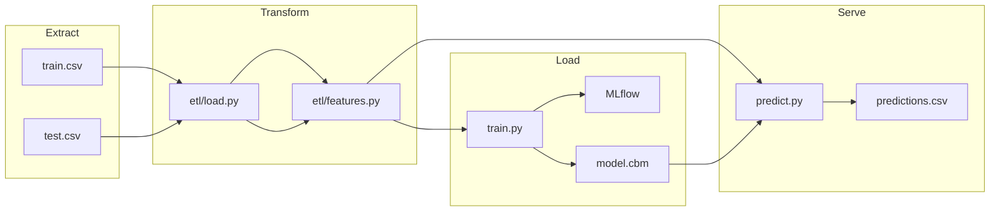

# Участник 1, Участник 2, Участник 3, Участник 4 — Прогноз отказов оборудования (keis7)

**Групповой проект · команда из 4 человек**  
Дисциплина: **«Автоматизация машинного обучения»** (Нетология).  
Автоматизированный ML-пайплайн для бинарной классификации отказов промышленного оборудования на датасете [Kaggle Playground Series S3E17](https://www.kaggle.com/competitions/playground-series-s3e17).

> **GitHub (основной):** https://github.com/Deferon/bhemml-25-amo-2  
> **GitHub (команда):** https://github.com/svscrip/auto_ML-prediction_machines_failures/tree/Yanshin  
> **Доступ преподавателю:** добавьте collaborator `@ElenaSmyslovskikh`.

---

## 1. Бизнес-задача

Производственное оборудование генерирует телеметрию (температура, обороты, момент, износ инструмента). Необходимо **заранее оценивать вероятность отказа** (`Machine failure`), чтобы:

- сократить внеплановые простои;
- планировать обслуживание по риску, а не по календарю;
- выдавать рекомендации по КПД и износу инструмента.

Исходный аналитический кейс: [reference-material/keis7-research](reference-material/keis7-research) (ноутбуки `case7.ipynb`, CatBoost в `special_versions/`). Данные для пайплайна: `keis7-main/train.csv`, `keis7-main/test.csv`.

---

## 2. Схема пайплайна



---

## 3. ETL (Extract, Transform, Load)

| Этап | Модуль | Описание |
|------|--------|----------|
| **Extract** | `src/etl/load.py` | Загрузка CSV, проверка схемы и пропусков |
| **Transform** | `src/etl/features.py` | Инженерные признаки из `reference-material/keis7-research/case7.ipynb`, удаление противоречивых строк (`Machine failure=0` при активных флагах отказа) |
| **Load** | `src/train.py` | Обучение CatBoost, сохранение модели и метрик в `artifacts/` |

**Ключевые преобразования:**

- `delta_temperature [K]` = Process − Air temperature  
- `Power [kW]` = Torque × RPM / 9550  
- `efficiency [%]` — КПД системы  
- `total_failures_cum` — накопленная сумма флагов отказов по (Type, Product ID)

---

## 4. Архитектура ML-модели

- **Алгоритм:** CatBoostClassifier  
- **Признаки:** температуры, RPM, момент, износ, Type, TWF/HDF/PWF/OSF, инженерные поля  
- **Балансировка:** `auto_class_weights=Balanced`  
- **Валидация:** stratified hold-out 80/20  
- **Early stopping** по AUC на validation set  

> **Примечание:** флаги TWF/HDF/PWF/OSF сильно коррелируют с целевой переменной (как в EDA keis7). Для учебного кейса они включены; для production рекомендуется отдельная модель без них.

Конфигурация: [`src/config.py`](src/config.py).

---

## 5. Метрики модели

Алгоритм: **CatBoostClassifier**, stratified hold-out **80/20**, `auto_class_weights=Balanced`, early stopping по **AUC**.

**Текущие метрики пайплайна** ([`artifacts/metrics.json`](artifacts/metrics.json), smoke 5 000 строк):

| Метрика | Значение |
|---------|----------|
| **ROC-AUC** | **0,934** |
| **Recall** | **0,786** |
| **Precision** | **0,393** |
| **F1** | **0,524** |
| **Accuracy** | **0,980** |
| Время обучения | **~5,3 с** |

> Низкий Precision типичен для сильно несбалансированного класса: модель агрессивнее ловит отказы (высокий Recall).

**Базовое исследование keis7** (кросс-валидация, [`model_metadata.json`](reference-material/keis7-research/model_metadata.json)):

| Метрика | Mean | Std |
|---------|------|-----|
| ROC-AUC | 0,927 | 0,007 |
| Recall | 0,804 | 0,024 |
| Precision | 0,364 | 0,012 |
| F1 | 0,501 | 0,013 |

**Важность признаков (Top-5):**

| Признак | Importance |
|---------|------------|
| Torque [Nm] | 11,37 |
| Air temperature [K] | 10,75 |
| Rotational speed [rpm] | 10,68 |
| air_mass | 9,97 |
| Tool wear [min] | 9,87 |

---

## 6. Визуализации

### EDA (разведочный анализ keis7)

| Распределение отказов | КПД vs износ | Тренд КПД |
|-----------------------|--------------|-----------|
|  |  |  |

### Модель CatBoost (пайплайн)

| Confusion Matrix | ROC Curve | Feature Importance |
|------------------|-----------|-------------------|
|  |  |  |

> Актуальные версии после каждого обучения также сохраняются в `artifacts/plots/` и MLflow UI.

---

## 7. Расширенная аналитика

### 7.1. Исходные данные

| Параметр | Значение |
|----------|----------|
| Источник | [Kaggle Playground Series S3E17](https://www.kaggle.com/competitions/playground-series-s3e17) |
| Train | ~136 429 записей (`keis7-main/train.csv`) |
| Test | ~90 954 записей (`keis7-main/test.csv`) |
| Целевая переменная | `Machine failure` (бинарная) |
| Доля отказов (train) | **~1,6–1,8%** (сильный дисбаланс классов) |
| Типы оборудования | **L** (low), **M** (medium), **H** (high) |

**Сырые признаки:** `Air temperature [K]`, `Process temperature [K]`, `Rotational speed [rpm]`, `Torque [Nm]`, `Tool wear [min]`, `Type`, флаги отказов **TWF, HDF, PWF, OSF, RNF**.

**Инженерные признаки (пайплайн):** `delta_temperature [K]`, `Power [kW]`, `air_mass`, `air_heat_power [kW]`, `efficiency [%]`, `total_failures_cum`.

### 7.2. EDA — ключевые выводы

Исходное исследование: [`reference-material/keis7-research/`](reference-material/keis7-research/) (отчёт [`analysis_results_20251206_154833/`](reference-material/keis7-research/analysis_results_20251206_154833/)).

| Показатель | Значение |
|------------|----------|
| Средний КПД системы | **55,82%** (диапазон 50–78%) |
| Средний износ инструмента | **104,4 мин** |
| Всего отказов | **4 239** (~1,8%) |

- Сильная **отрицательная корреляция** между КПД и износом инструмента.
- Отказы чаще при износе **~1,2× выше среднего**.
- Рекомендации EDA: оповещение при КПД **< 80%**, замена инструмента **~200 мин**, диагностика при износе **> 150 мин**.

### 7.3. Качество данных после ETL

Отчёт: [`artifacts/data_quality.json`](artifacts/data_quality.json).

| Показатель | Значение |
|------------|----------|
| Пропуски | **0** по всем колонкам |
| Доля `Machine failure` | **1,38%** |
| Type L / M / H | 3 493 / 1 137 / 357 |

### 7.4. Результаты инференса

Файл: [`artifacts/predictions.csv`](artifacts/predictions.csv) — **90 954** прогноза.

| Уровень риска | Количество | Доля |
|---------------|------------|------|
| Низкий | 45 477 | ~50% |
| Средний | 36 381 | ~40% |
| **Высокий** | **9 096** | **~10%** |

### 7.5. Рекомендации по обслуживанию

[`artifacts/maintenance_recommendations.csv`](artifacts/maintenance_recommendations.csv):

| Проблема | Решение | Приоритет |
|----------|---------|-----------|
| Низкая эффективность системы | Настроить систему при КПД < 50% | Высокий |
| Критический износ инструмента | Плановые замены при износе > **192 мин** | Высокий |
| Высокий прогноз отказа | Целевое обслуживание с `risk_level=Высокий` | Высокий |

### 7.6. Дрейф данных (train → test)

[`artifacts/inference_monitoring.json`](artifacts/inference_monitoring.json) — PSI **< 0,001** по всем признакам. Существенного дрейфа не выявлено.

---

## 8. AutoML и автоматизация пайплайна

По ТЗ допускается использование готового AutoML-сервиса **или** автоматизация отдельных элементов архитектуры.

### 8.1. Используемая ML-модель

- **CatBoostClassifier** — кастомная модель (не внешний AutoML-сервис вроде H2O/Auto-sklearn).
- Выбор обоснован: нативная работа с категориальными признаками (`Type`, флаги отказов), `auto_class_weights=Balanced` для дисбаланса классов, early stopping по AUC.
- Гиперпараметры заданы в [`src/config.py`](src/config.py) (`CATBOOST_PARAMS`).

### 8.2. Автоматизация элементов пайплайна

1. **Единый конфиг** гиперпараметров CatBoost (`CATBOOST_PARAMS` в `config.py`).  
2. **Скрипт обучения** `python -m src.train` с артефактами и MLflow.  
3. **Скрипт инференса** `python -m src.predict` → `predictions.csv`, `maintenance_recommendations.csv`.  
4. **CI smoke-тест** — автоматический прогон обучения на подвыборке в GitHub Actions.  
5. **Docker** — воспроизводимый запуск train/predict в контейнере.  
6. **MLflow** — единый tracking URI (`artifacts/mlflow.db` + `artifacts/mlartifacts/`).

---

## 9. Тестирование (pytest)

```bash
pip install -r requirements.txt
pytest -q                  # без медленных тестов
pytest -q -m slow          # полный smoke на 5000 строк
```

| Тест | Проверка |
|------|----------|
| `tests/test_load.py` | Схема train.csv |
| `tests/test_features.py` | Формулы Power, efficiency |
| `tests/test_train.py` | Smoke-обучение и метрики |

---

## 10. Docker

### Dockerfile (используемый образ и команды)

```dockerfile
FROM python:3.11-slim          # базовый образ Python
WORKDIR /app                   # рабочая директория
RUN apt-get update && apt-get install -y --no-install-recommends libgomp1 \
    && rm -rf /var/lib/apt/lists/*   # libgomp для CatBoost
COPY requirements.txt .
RUN pip install --no-cache-dir -r requirements.txt   # зависимости
COPY src/ ./src/
COPY conftest.py pytest.ini ./
COPY keis7-main/train.csv keis7-main/test.csv ./keis7-main/
ENV PYTHONPATH=/app
ENV MLFLOW_TRACKING_URI=sqlite:////app/artifacts/mlflow.db
RUN mkdir -p /app/artifacts
ENTRYPOINT ["python", "-m"]
CMD ["src.train", "--smoke"]   # smoke-обучение по умолчанию
```

### Зачем контейнеризация

- **Воспроизводимость** — фиксированные версии библиотек;
- **Изоляция** — независимость от локального окружения;
- **Безопасность и ресурсы** — единый способ запуска на CI/CD и сервере без изменения хост-системы.

### Команды

```bash
docker build -t machine-failure-mlops:latest .

docker run --rm -v "%cd%/artifacts:/app/artifacts" machine-failure-mlops:latest src.train
docker run --rm -v "%cd%/artifacts:/app/artifacts" machine-failure-mlops:latest src.predict

docker compose up train
docker compose up mlflow   # UI на http://localhost:5000
```

---

## 11. CI/CD

Workflow: [`.github/workflows/ci.yml`](.github/workflows/ci.yml)

1. `checkout`  
2. `setup-python` 3.11  
3. `pip install -r requirements.txt`  
4. `pytest -q`  
5. `docker build` + smoke `src.train --smoke` в контейнере  

### Git-команды (использованные при разработке)

```bash
git init
git add .
git commit -m "Initial MLOps pipeline for machine failure prediction"
git branch -M main

git remote add origin https://github.com/Deferon/bhemml-25-amo-2.git
git push -u origin main

git remote add svscrip https://github.com/svscrip/auto_ML-prediction_machines_failures.git
git push svscrip main:Yanshin
```

**Командная работа (ветки и pull request):**

```bash
git checkout -b feature/uchastnik-1-etl
git add . && git commit -m "feat: ETL and feature engineering"
git push -u origin feature/uchastnik-1-etl
gh pr create --title "Участник 1: ETL" --base main

git checkout main && git pull
git checkout -b feature/uchastnik-2-train
# ... аналогично для Участника 2, 3, 4
```

---

## 12. Мониторинг

### Качество модели (MLflow)

- **Метаданные:** `artifacts/mlflow.db` (SQLite)  
- **Артефакты runs:** `artifacts/mlartifacts/`  
- **Эксперимент:** `machine_failure_prediction`  

Логируются: параметры CatBoost, ROC-AUC, Precision, Recall, F1, время обучения, графики, модель.

```bash
.\scripts\start-mlflow.ps1          # локально
docker compose up mlflow            # http://localhost:5000
```

### Качество данных и дрейф

| Файл | Назначение |
|------|------------|
| `artifacts/data_quality.json` | Статистики train, пропуски, распределение Type |
| `artifacts/inference_monitoring.json` | PSI, сдвиг средних train→test |
| `artifacts/maintenance_recommendations.csv` | Бизнес-рекомендации |
| `artifacts/predictions.csv` | Прогнозы по каждой единице оборудования |

**PSI (Population Stability Index):** все признаки **< 0,001** — дрейф не выявлен (подробнее в §7.6).

### Инфраструктура (CPU/RAM)

Модуль [`src/monitoring.py`](src/monitoring.py) фиксирует загрузку через `psutil` до и после обучения ([`artifacts/data_quality.json`](artifacts/data_quality.json)):

| Момент | CPU | RAM (использовано) |
|--------|-----|---------------------|
| До обучения | 18,1% | 54,3% (31,9 GB total) |
| После обучения | 5,7% | 54,5% |

Время обучения smoke-прогона: **~5,3 с** ([`artifacts/metrics.json`](artifacts/metrics.json)).

---

## 13. GitHub-репозиторий

| Репозиторий | Назначение | Ссылка |
|-------------|------------|--------|
| Основной | Полный MLOps-пайплайн | https://github.com/Deferon/bhemml-25-amo-2 |
| Командный | Ветка сдачи проекта | https://github.com/svscrip/auto_ML-prediction_machines_failures/tree/Yanshin |

- Репозитории **публичные** (открытый доступ для проверки).
- CI: GitHub Actions — pytest + Docker smoke train (см. §11).
- Доступ преподавателю: `@ElenaSmyslovskikh`.

---

## 14. Презентация

Структура слайдов (5–7): [`docs/presentation.md`](docs/presentation.md).

---

## 15. Участники и формат

- **Формат:** групповой проект (**4 участника**, допустимо по ТЗ 2–4 человека)
- **Преподаватель:** `@ElenaSmyslovskikh`

| № | Участник | Зона ответственности |
|---|----------|---------------------|
| 1 | **Участник 1** | ETL, feature engineering, EDA (keis7) |
| 2 | **Участник 2** | Обучение модели, MLflow, метрики |
| 3 | **Участник 3** | Инференс, мониторинг, рекомендации по обслуживанию |
| 4 | **Участник 4** | Docker, CI/CD, README, презентация |

### Git workflow команды

По ТЗ: каждый участник работает в **отдельной ветке**, изменения вливаются через **pull request**.

| Участник | Пример ветки | Область |
|----------|--------------|---------|
| Участник 1 | `feature/uchastnik-1-etl` | `src/etl/`, `tests/test_features.py` |
| Участник 2 | `feature/uchastnik-2-train` | `src/train.py`, MLflow |
| Участник 3 | `feature/uchastnik-3-predict` | `src/predict.py`, `src/monitoring.py` |
| Участник 4 | `feature/uchastnik-4-devops` | Docker, CI, README, docs |

---

## Приложение A. Быстрый старт (локально)

```bash
python -m venv .venv
.venv\Scripts\activate
pip install -r requirements.txt

python -m src.train          # полное обучение
python -m src.train --smoke  # быстрый прогон
python -m src.predict
```

Структура проекта:

```
bhemml-25-amo-2/
├── src/                 # пайплайн
├── tests/               # pytest
├── keis7-main/          # train.csv, test.csv
├── reference-material/  # ноутбуки, задание, исследования
├── docs/                # презентация, images/
├── artifacts/           # модель, метрики, предсказания
├── scripts/             # локальный запуск
├── Dockerfile
├── docker-compose.yml
└── .github/workflows/ci.yml
```

---

## Лицензия и данные

Данные: Kaggle Playground Series S3E17. Исходные ноутбуки keis7 — учебный репозиторий команды кейса 7.
