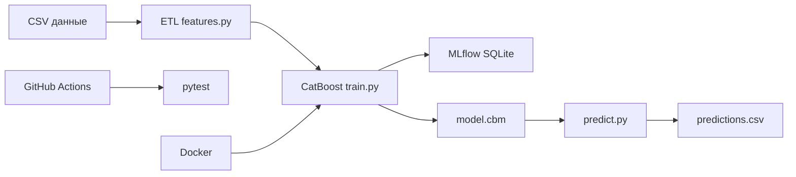

# Презентация: Прогноз отказов оборудования (keis7)

## Слайд 1 — Команда и бизнес-задача

**Команда:** Участник 1, Участник 2, Участник 3, Участник 4 (групповой проект, Нетология).

**Цель:** заранее выявлять риск отказа промышленного оборудования (`Machine failure`), чтобы снизить простои и перейти на предиктивное обслуживание.

**Ключевой вопрос:** при каких сочетаниях температуры, нагрузки, износа инструмента и типа отказа вероятность поломки становится критической?

---

## Слайд 2 — Данные и признаки

- Источник: Kaggle Playground Series S3E17 (`train.csv` ~136k записей, `test.csv` ~91k).
- Целевая переменная: `Machine failure` (дисбаланс ~1.6% положительного класса).
- Сырые признаки: температуры, обороты, момент, износ, тип оборудования L/M/H.
- Инженерные признаки: `delta_temperature`, `Power [kW]`, `efficiency [%]`, `total_failures_cum`.
- Флаги типов отказов: TWF, HDF, PWF, OSF (используются с оговоркой о корреляции с целью).

---

## Слайд 3 — Архитектура ML-системы

---

## Слайд 4 — Результаты тестирования модели

- Алгоритм: **CatBoostClassifier** (`auto_class_weights=Balanced`, early stopping по AUC).
- **ROC-AUC: 0,934** | Recall: 0,786 | Precision: 0,393 | F1: 0,524
- Время обучения (smoke): ~5,3 с
- Top-3 признака: Torque, Air temperature, Rotational speed
- Графики: confusion matrix, ROC-кривая, feature importance (см. `docs/images/`)

---

## Слайд 5 — Выводы для бизнеса

- **9 096** единиц оборудования (~10%) с высоким `risk_level` — приоритетное обслуживание.
- Рекомендации: КПД < 50%, износ инструмента > 192 мин, целевой ремонт по прогнозу.
- EDA: отрицательная корреляция КПД и износа → плановая замена инструмента (~200 мин).
- Дрейф данных train→test не выявлен (PSI < 0,001) — модель стабильна на test.
- Переход от календарного ТО к **предиктивному обслуживанию** по телеметрии.

---

## Слайд 6 — Итоги

- Групповой проект **4 участников**: автоматизированный ML-пайплайн (ETL → CatBoost → MLflow → predict).
- Покрыты требования ТЗ: pytest, Docker, CI/CD, мониторинг качества модели и инфраструктуры.
- Дальнейшее развитие: production-модель без флагов отказов, API, алерты в IoT.
