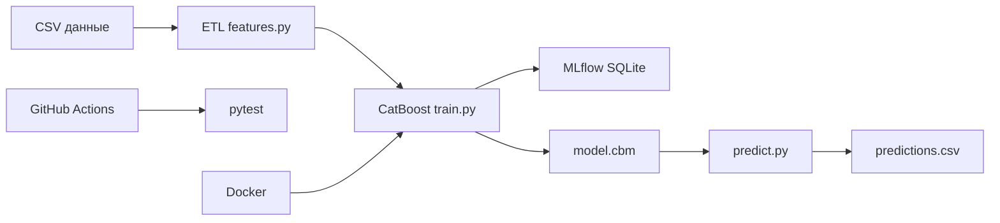

# Презентация: Прогноз отказов оборудования (keis7)

## Слайд 1 — Бизнес-задача

**Цель:** заранее выявлять риск отказа промышленного оборудования (`Machine failure`), чтобы снизить простои и перейти на предиктивное обслуживание.

**Ключевой вопрос:** при каких сочетаниях температуры, нагрузки, износа инструмента и типа отказа вероятность поломки становится критической?

---

## Слайд 2 — Данные и признаки

- Источник: Kaggle Playground Series S3E17 (`train.csv` ~136k записей, `test.csv` ~91k).
- Целевая переменная: `Machine failure` (дисбаланс ~1.6% положительного класса).
- Сырые признаки: температуры, обороты, момент, износ, тип оборудования L/M/H.
- Инженерные признаки: `delta_temperature`, `Power [kW]`, `efficiency [%]`, `total_failures_cum`.
- Флаги типов отказов: TWF, HDF, PWF, OSF (используются с оговоркой о корреляции с целью).

---

## Слайд 3 — Архитектура ML-системы

---

## Слайд 4 — Модель и метрики

- Алгоритм: **CatBoostClassifier** (категориальные признаки, `auto_class_weights=Balanced`, early stopping).
- Метрики на валидации: ROC-AUC, Precision, Recall, F1 (см. `artifacts/metrics.json`).
- Автоматизация: конфиг в `src/config.py`, логирование экспериментов в MLflow, CI smoke-тесты.

---

## Слайд 5 — Тестирование, Docker, CI/CD

- **pytest:** схема данных, формулы признаков, smoke-обучение.
- **Docker:** воспроизводимое окружение, команды `train` / `predict`.
- **GitHub Actions:** установка зависимостей → pytest → сборка образа → smoke train в контейнере.

---

## Слайд 6 — Мониторинг и выводы для бизнеса

- MLflow: параметры, метрики, артефакты (матрица ошибок, ROC, важность признаков).
- Контроль данных: отчёт `data_quality.json`, дрейф признаков в `inference_monitoring.json`.
- Рекомендации: `maintenance_recommendations.csv` — КПД, износ инструмента, высокий `risk_level`.
- Практика: плановая замена инструмента при высоком износе; усиленный мониторинг при низком КПД.

---

## Слайд 7 — Итоги

- Реализован автоматизированный ML-пайплайн на базе исходников keis7.
- Модель пригодна для ранжирования риска отказа и интеграции в систему ТО.
- Дальнейшее развитие: отдельная production-модель без флагов отказов, деплой API, алерты в IoT.
